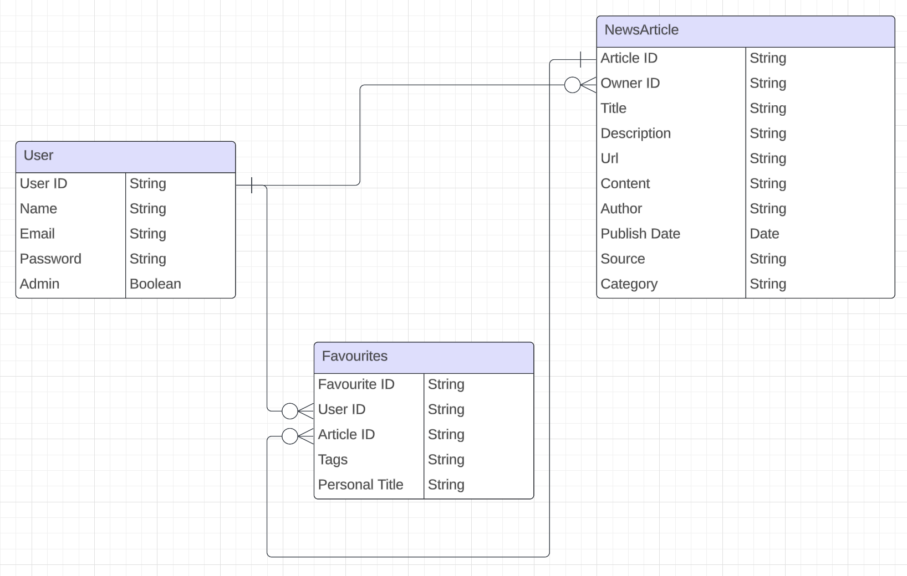

# Description

- **App Name:** Personalized News App
- **Description:** An app to get news based on user preference and interest.
- **Github URL:**  https://github.com/amritadutta25/Personalized_News_app_backend
- **Deployed Website:** 

# Problem Being Solved and Target Market
To create a news outlet to let usres get news articles based on their interest and preferences without having to filter out news manually.

# List of Dependencies
- FastAPI
- requests
- uvicorn
- SQLAlchemy

To install all dependencies, run
`pip install -r dependencies.txt`

## User Stories

- Users should be able to see the site on desktop and mobile
- Users can create an account
- Users can sign in to their account
- Users can select their news preferences
- Users can see all news articles
- Users can see news articles based on their preference
- Users can create new articles
- Users who are authors can update news articles they have written
- Users who are authors can delete news articles they have written

- Admin can add news articles using third party API
- Admin user can update tags and categories of news articles
- Admin user can delete outdated, incorrect, or irrelevant articles from the database

- Users can bookmark news articles they like and add a personalized title
- Users can view all bookmarked news articles
- Users can update their bookmarked list by updating their category or personalized title
- Users can delete bookmarked news articles 

## Route Map

### News Articles routes:
| Route Name | Endpoint | Method | Description |
|------------|----------|--------|-------------|
| Index | /news/ | GET | Renders all news on a page|
| Delete | /news/:id/ | DELETE | Deletes a news article from database|
| Update | /news/:id/ | PUT | Updates existing news article|
| Create | /news/ | POST | A user creates a news article|
| Create | /news/fetch | POST | Admin fetched news articles from third party API|
| Show | /news/:id/ | GET | Renders a news article on a page|
| Show | /news/:category/ | GET | Renders news articles based on category |
| Show | /news/:date/ | GET | Renders news articles based on date |

### Favourite News Articles routes:
| Route Name | Endpoint | Method | Description |
|------------|----------|--------|-------------|
| Index | /news/favourites | GET | Renders all liked news articles on a page|
| Delete | /news/favourites/:id/ | DELETE | Deletes a news article from favourite list|
| Update | /news/favourites/:id/ | PUT | Updates news article in favourite list|
| Create | /news/favourites | POST | A user adds a news article as a favourite|

### User routes:
| Route Name | Endpoint | Method | Description |
|------------|----------|--------|-------------|
| Signup form | /user/signup | GET | Renders a form to register a new user |
| Signup | /user/signup | POST | Register a new user |
| Login form | /user/login | GET | Renders a form to login existing user |
| Login | /user/login | POST | Login an existing user |

## ERD (Entity Relationship Diagram)

## Model Fields

### User Model Fields

| Field Name | Description |
|------------|----------|
| User ID | Unique identifier for user (Primary Key) |
| Name | User name |
| Email | User acount Email ID |
| Password | User account password |
| Admin | True if Admin, else False  |

### News Article Model Fields

| Field Name | Description |
|------------|----------|
| Article ID | Unique identifier for each news article (Primary Key) |
| Owner ID| Identifier for the user owning the news articles (Foreign Key). It is Admin ID if news fetched from third party API, USER ID if user authored the news article |
| Title | News Article title |
| Description | Brief information about the news |
| Url | Link to complete news article |
| Content | Full news content fetched from the URL  |
| Author | Author of the news article. Could be a reference to User if users can also be authors |
| Publish Date | The published date of the news article |
| Source | Domain of the source |
| Category | List of categories the news article is identified as. |

### Favourite Articles Model Fields

| Field Name | Description |
|------------|----------|
| Favourite ID | Unique identifier for the news article (Primary Key) |
| User ID | Identifier for the user who liked the news articles (Foreign Key linked to User) |
| Article ID | News Article ID (Foreign Key linked to NewsArticle) |

